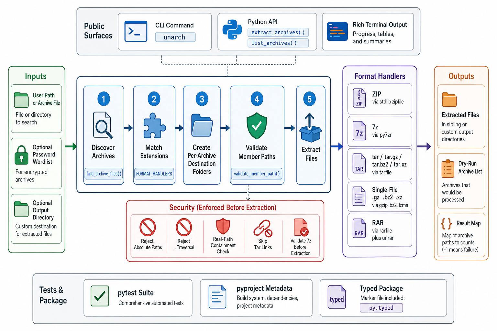

<div align="center">
  

  <h1>unarch</h1>

  **Recursively extract ZIP, 7z, tar, RAR, and single-file compressed archives from directory trees**
</div>

`unarch` is a Python library and CLI for finding archives under a path and extracting each one into its own output folder. It supports dry runs, password wordlists, custom output directories, quiet/verbose terminal output, and programmatic use from Python.

The extractor validates archive member paths before writing files so absolute paths, `..` traversal, tar links, and unsafe 7z members do not escape the destination directory.

## Install

```bash
pip install unarch
unarch --dry-run /path/to/search
unarch /path/to/search
```

For an isolated CLI install:

```bash
uv tool install unarch
```

For local development:

```bash
git clone https://github.com/tsilva/unarch.git
cd unarch
uv run --group dev pytest tests/ -v
```

## Commands

```bash
unarch PATH                         # extract supported archives under PATH
unarch --dry-run PATH               # list archives without extracting
unarch --passwords passwords.txt PATH
unarch --output-dir extracted PATH  # write outputs under a custom directory
unarch -v PATH                      # print each extracted file
unarch -q PATH                      # suppress terminal output
unarch --version                    # print the installed version
uv run --group dev pytest tests/ -v # run the test suite
```

## Library

```python
from unarch import extract_archives, list_archives

archives = list_archives("/path/to/search")
results = extract_archives(
    "/path/to/search",
    output_dir="/path/to/output",
    passwords=["secret", "fallback"],
    output_suffix="_archive",
    skip_existing=True,
)
```

`extract_archives()` returns a dictionary mapping archive paths to extracted file counts. A count of `-1` means extraction failed.

## Notes

- Supported formats: `.zip`, `.7z`, `.tar`, `.tgz`, `.tar.gz`, `.tar.bz2`, `.tbz2`, `.tbz`, `.tar.xz`, `.txz`, `.gz`, `.bz2`, `.xz`, and `.rar`.
- ZIP, 7z, and RAR can use passwords from `--passwords`; tar and single-file compression formats do not support passwords.
- RAR extraction requires the `unrar` system binary in addition to the Python `rarfile` package.
- By default, each archive extracts to a sibling directory named after the archive without its archive extension.
- `--output-dir` changes the base output location while preserving one destination folder per archive.
- The package is typed with `py.typed` and requires Python 3.10 or newer.

## Architecture



## License

[MIT](LICENSE)
